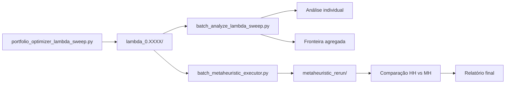

# Integração: Portfolio Metaheuristic Executor + Lambda Sweep

## 📋 Análise do Portfolio Metaheuristic Executor

### **O que ele faz atualmente:**

1. **Recebe como entrada:**
   - `hh_result.json` - Resultado da hiperheurística (índices dos operadores selecionados)
   - `instance_file` - Arquivo da instância (port1.txt, port2.txt, etc)
   - `cardinality` - Restrição de cardinalidade
   - `collection_file` - Coleção de operadores (default_portfolio.txt)
   - `num_iterations` - Número de iterações
   - `--lambda` - Parâmetro lambda (padrão: 0.5)

2. **Processo:**
   - Lê o `hh_result.json` e extrai os índices dos operadores
   - Carrega os operadores da coleção usando esses índices
   - Constrói uma sequência de operadores
   - Executa uma **Metaheurística** (não hiperheurística!) com essa sequência fixa
   - Gera logs de execução em `execution_logs.csv`
   - Salva metadados em `metaheuristic_metadata.json`

3. **Saída:**
   ```
   <output_dir>/
   ├── execution_logs.csv
   └── metaheuristic_metadata.json
   ```

### **Diferença chave: Metaheuristic vs Hyperheuristic**
- **Hyperheuristic (CustomHyS):** Seleciona dinamicamente quais operadores usar a cada iteração
- **Metaheuristic (executor):** Usa uma sequência **fixa** de operadores previamente selecionados

---

## 📂 Estrutura do Lambda Sweep

### **Cada pasta `lambda_X.XXXX/` contém:**

```
lambda_0.0200/
├── execution_logs.csv          # Logs da HH (todas avaliações)
├── data_files_raw/
│   └── hh_result.json          # Índices dos operadores selecionados pela HH
│   └── hh_fitness.json         # Fitness da HH ao longo das iterações
│   └── hh_operators.json       # Uso dos operadores pela HH
│   └── hh_selectors.json       # Uso dos seletores
│   └── hh_resume.txt           # Resumo da execução
├── analysis_metrics.csv        # Métricas de análise (gerado depois)
├── population_pareto_frontier.csv
├── population_best_efficient.csv
└── population_best_pareto.csv
```

### **Informações importantes:**
- ✅ `hh_result.json` - **Contém os operadores selecionados pela HH**
- ✅ `execution_logs.csv` - Logs da execução da HH
- ✅ `lambda_X.XXXX` - Nome da pasta indica o valor de lambda usado
- ✅ Instância e cardinalidade são **as mesmas** para todo o sweep

---

## 🎯 Proposta de Integração

### **Objetivo:**
Criar um script `batch_metaheuristic_executor.py` que:
1. Percorre cada pasta `lambda_X.XXXX/` do sweep
2. Lê o `hh_result.json` de cada pasta
3. Executa o `portfolio_metaheuristic_executor` usando os operadores descobertos pela HH
4. Gera novos logs de execução para comparação

### **Arquitetura proposta:**

```python
batch_metaheuristic_executor.py
    │
    ├─ Detecta todas as pastas lambda_*
    ├─ Para cada lambda:
    │   ├─ Lê hh_result.json
    │   ├─ Executa Metaheuristic com operadores fixos
    │   ├─ Salva em lambda_X.XXXX/metaheuristic_rerun/
    │   └─ Compara performance HH vs MH
    │
    └─ Gera relatório agregado
```

### **Estrutura de saída:**

```
lambda_0.0200/
├── execution_logs.csv                    # Original da HH
├── data_files_raw/
│   └── hh_result.json
├── metaheuristic_rerun/                  # NOVO
│   ├── execution_logs.csv                # Logs da MH com operadores fixos
│   ├── metaheuristic_metadata.json
│   └── comparison_hh_vs_mh.json          # Comparação de performance
├── analysis_metrics.csv
└── ...
```

---

## 🔧 Funcionalidades do novo script

### **1. Modo básico - Reexecutar com operadores da HH**
```bash
python batch_metaheuristic_executor.py <sweep_dir> \
    --instance port1.txt \
    --cardinality 10 \
    --collection default_portfolio.txt \
    --iterations 1000
```

**O que faz:**
- Percorre cada lambda
- Usa os operadores do `hh_result.json`
- Executa a Metaheuristic com os mesmos parâmetros
- Salva em `metaheuristic_rerun/`

### **2. Modo paralelo**
```bash
python batch_metaheuristic_executor.py <sweep_dir> \
    --instance port1.txt \
    --cardinality 10 \
    --collection default_portfolio.txt \
    --iterations 1000 \
    --workers 4
```

**Melhoria:** Processa 4 lambdas simultaneamente

### **3. Modo comparação**
```bash
python batch_metaheuristic_executor.py <sweep_dir> \
    --instance port1.txt \
    --cardinality 10 \
    --collection default_portfolio.txt \
    --iterations 1000 \
    --compare
```

**Adicional:**
- Compara melhor fitness HH vs MH
- Compara tempo de execução
- Gera gráficos de convergência
- Salva estatísticas agregadas

### **4. Modo análise automática**
```bash
python batch_metaheuristic_executor.py <sweep_dir> \
    --instance port1.txt \
    --cardinality 10 \
    --collection default_portfolio.txt \
    --iterations 1000 \
    --analyze
```

**Adicional:**
- Executa `analyze_portfolio_results` automaticamente
- Gera fronteiras de Pareto da MH
- Compara fronteiras HH vs MH

---

## 🤔 Questões a responder

### **1. Número de iterações**
- **HH:** Usa `num_iterations` da configuração
- **MH:** Quantas iterações usar?
  - **Opção A:** Mesmo número da HH (justo para comparação)
  - **Opção B:** Número configurável (pode testar diferentes cenários)
  - **Opção C:** Calcular baseado no número de avaliações da HH

**Sugestão:** Opção B (configurável) com padrão = mesmo da HH

### **2. Número de agentes**
- **HH:** Usa `num_agents` da configuração
- **MH:** Usar o mesmo número?

**Sugestão:** Sim, usar o mesmo

### **3. Logger**
- Gerar logs detalhados ou só resultado final?

**Sugestão:** Gerar logs completos para análise posterior

### **4. Seed aleatório**
- **HH:** Usa seed baseado em timestamp + execution_order
- **MH:** Como garantir reprodutibilidade?

**Sugestão:** Usar seed fixo baseado no lambda (ex: `hash(lambda_value)`)

### **5. Comparação justa**
- Como comparar HH (adaptativa) vs MH (fixa)?

**Possíveis métricas:**
- Melhor fitness encontrado
- Tempo de execução
- Número de avaliações
- Qualidade da fronteira de Pareto
- Convergência (fitness vs iterações)

---

## 📊 Casos de uso

### **Caso 1: Validar descoberta da HH**
**Objetivo:** Verificar se os operadores descobertos pela HH são bons
**Processo:**
1. HH descobre operadores durante sweep
2. MH reexecuta com operadores fixos
3. Comparar: MH consegue resultados similares?

**Insight:** Se MH tem performance próxima, os operadores são bons!

### **Caso 2: Explorar variações de lambda**
**Objetivo:** Testar se operadores de um lambda funcionam em outros
**Processo:**
1. Pegar operadores do lambda_0.5000
2. Executar MH em todos os outros lambdas
3. Ver onde funciona bem

**Insight:** Operadores são específicos de lambda ou genéricos?

### **Caso 3: Benchmark de eficiência**
**Objetivo:** Comparar overhead da HH vs MH
**Processo:**
1. Medir tempo de execução HH
2. Medir tempo de execução MH
3. Comparar com mesmo budget de avaliações

**Insight:** Quanto tempo a HH gasta selecionando operadores?

---

## 🚀 Implementação sugerida

### **Fase 1: Script básico** ✅
```python
# Funcionalidades mínimas:
- Detectar pastas lambda_*
- Ler hh_result.json
- Executar Metaheuristic
- Salvar logs em metaheuristic_rerun/
```

### **Fase 2: Paralelização** 🔄
```python
# Adicionar:
- multiprocessing.Pool
- Processar múltiplos lambdas simultaneamente
- Progress tracking
```

### **Fase 3: Comparação** 📊
```python
# Adicionar:
- Comparar métricas HH vs MH
- Gerar gráficos de convergência
- Salvar estatísticas agregadas
```

### **Fase 4: Análise automática** 🎯
```python
# Adicionar:
- Executar analyze_portfolio_results
- Comparar fronteiras de Pareto
- Gerar relatório final
```

---

## 💡 Benefícios da integração

### **Para pesquisa:**
- ✅ Valida qualidade dos operadores descobertos
- ✅ Permite comparação HH vs MH
- ✅ Identifica operadores robustos vs específicos
- ✅ Benchmark de overhead da adaptação

### **Para otimização:**
- ✅ Reutiliza conhecimento da HH
- ✅ Execução mais rápida (MH sem overhead)
- ✅ Pode gerar melhores soluções com mais iterações

### **Para análise:**
- ✅ Mais dados para comparação
- ✅ Fronteiras de Pareto adicionais
- ✅ Insights sobre comportamento dos operadores

---

## 🎯 Próximos passos

1. **Decisão:** Confirmar arquitetura e funcionalidades
2. **Implementação:** Criar `batch_metaheuristic_executor.py`
3. **Teste:** Executar em um sweep pequeno
4. **Refinamento:** Adicionar comparações e análises
5. **Documentação:** Atualizar README com exemplos

---

## 🤝 Integração com fluxo existente



**Fluxo completo:**
1. `portfolio_optimizer_lambda_sweep.py` - Executa HH em múltiplos lambdas
2. `batch_analyze_lambda_sweep.py` - Analisa resultados da HH
3. `batch_metaheuristic_executor.py` - Reexecuta com operadores fixos (NOVO)
4. Comparação e análise final

---

## ❓ Perguntas para você

1. **Número de iterações:** Mesmo da HH ou configurável?
2. **Comparação:** Quais métricas são mais importantes?
3. **Casos de uso:** Qual dos 3 casos te interessa mais?
4. **Paralelização:** Quer desde a Fase 1 ou depois?
5. **Análise automática:** Executar `analyze_portfolio_results` automaticamente?

**Responda essas perguntas e eu implemento o script! 🚀**
